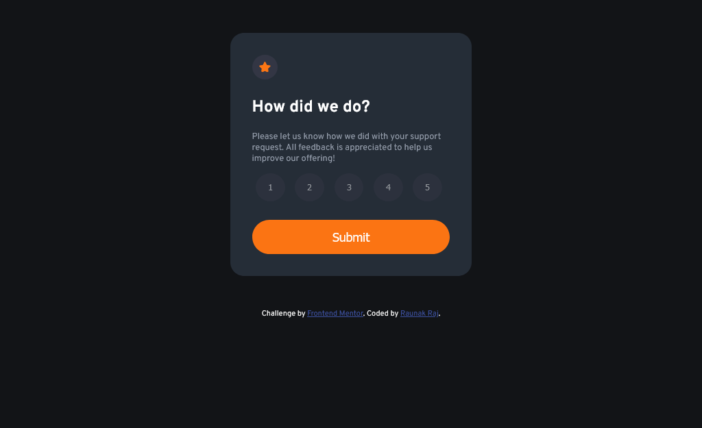
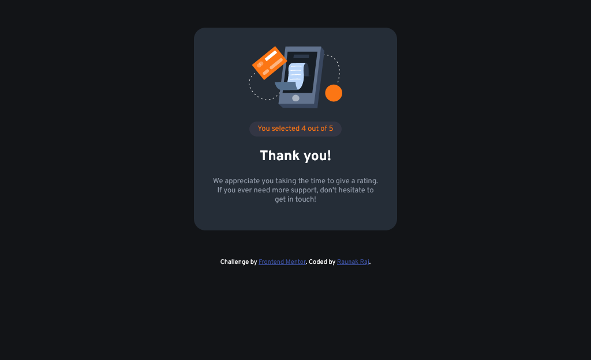
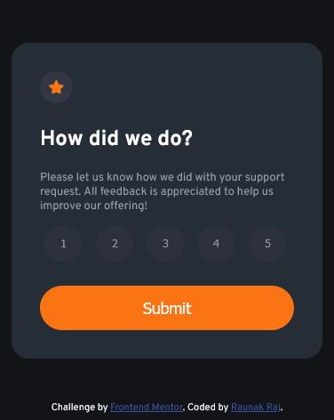
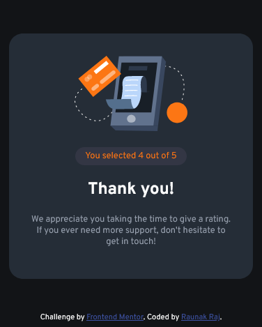

# Frontend Mentor - Interactive rating component solution

This is a solution to the [Interactive rating component challenge on Frontend Mentor](https://www.frontendmentor.io/challenges/interactive-rating-component-koxpeBUmI). Frontend Mentor challenges help you improve your coding skills by building realistic projects. 

## Table of contents

- [Overview](#overview)
  - [The challenge](#the-challenge)
  - [Screenshot](#screenshot)
  - [Links](#links)
- [My process](#my-process)
  - [Built with](#built-with)
  - [What I learned](#what-i-learned)
  - [Continued development](#continued-development)
  - [Useful resources](#useful-resources)
- [Author](#author)

## Overview

### The challenge

Users should be able to:

- View the optimal layout for the app depending on their device's screen size
- See hover states for all interactive elements on the page
- Select and submit a number rating
- See the "Thank you" card state after submitting a rating

### Screenshot

### Links

- Solution URL: [Github](https://your-solution-url.com)
- Live Site URL: [Add live site URL here](https://your-live-site-url.com)

## My process

### Built with

- Semantic HTML5 markup
- CSS custom properties
- Mobile-first workflow
- Basic Javascript

### What I learned

During this challenge I learned a lot of new Javascript objects and methods like .forEach(), .addEventListener(), etc.I have not mastered them yet but I will and use them more efficiently in future in more projects.

### Continued development

The working of this site is not very efficient and it could break very easily at so many points but still it completes the challenge.So I will let it be for now but will definetly improve in further in future when I will be more comapatible with JS.

### Useful resources

- [Stack Overflow](https://stackoverflow.com) - This is the best community for any progammer. You will get answers of all your questions.
- [MDN Webdocs](https://www.example.com) - This is an amazing site which gives detailed explanation of any programming term you could think of.

## Author

- Website - [Rauank Raj](https://www.your-site.com)
- Frontend Mentor - [@Raunak40](https://www.frontendmentor.io/profile/Raunak40)

